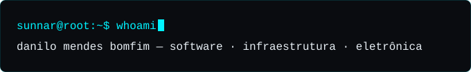
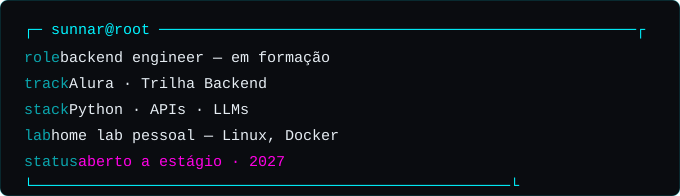
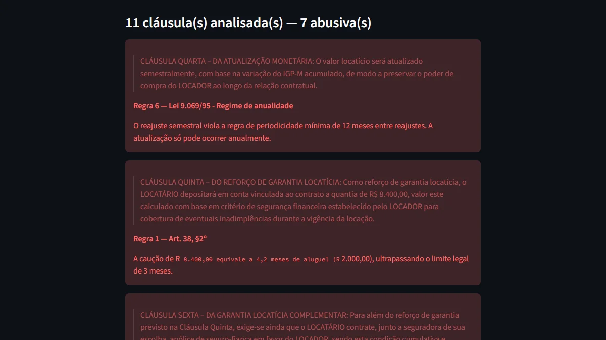
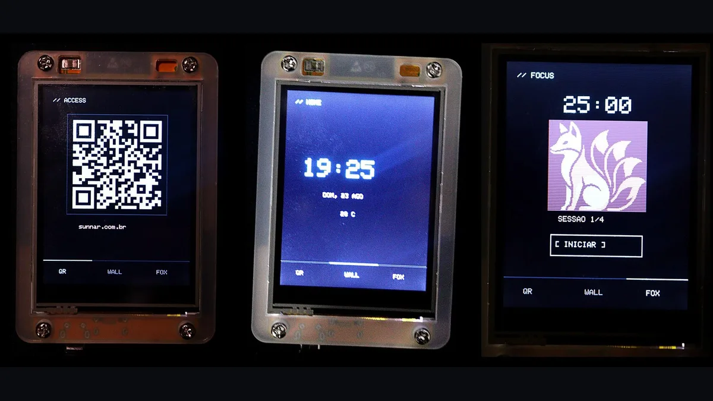
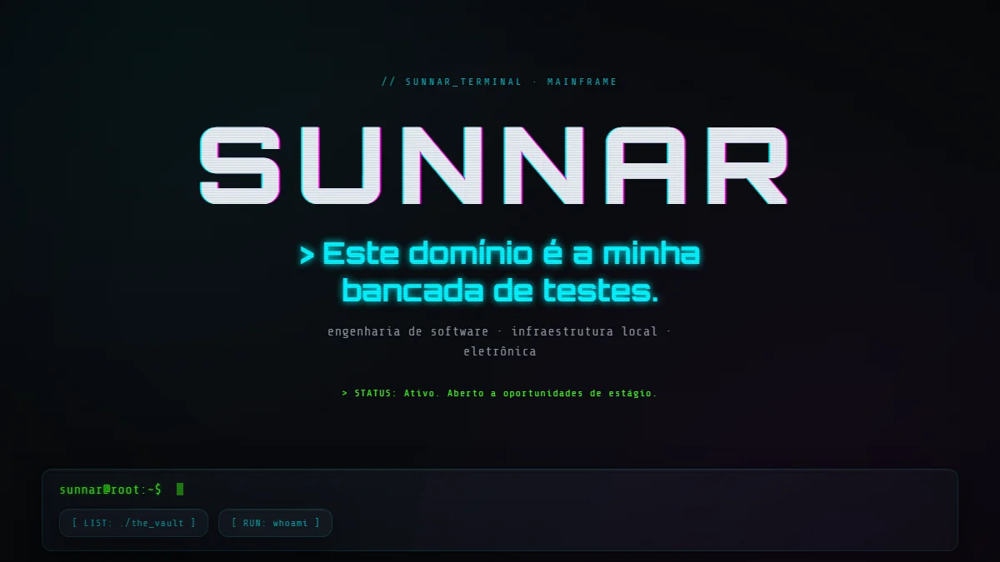

  

  
  

portfólio ao vivo &middot; código de cada projeto abaixo

 

## `sunnar@root:~$ whoami`

  

Vim do hardware. Técnico em eletrônica pelo IFG, depois quase dois anos de bancada na Kantar IBOPE Media diagnosticando equipamento de medição de audiência, dispositivos de rede e servidores de recepção — sob SLA, às vezes em sobreaviso.

Bancada não é coisa que eu deixei para trás. É onde aprendi a trabalhar: isolar a variável, reproduzir a falha, provar a causa antes de trocar a peça. Hoje curso Análise e Desenvolvimento de Sistemas na FIAP e aplico a mesma disciplina em código — este domínio é a minha bancada de testes. O que sobrevive ao teste vira projeto no vault abaixo; o resto fica como aprendizado.

> "Depurar uma placa é a mesma disciplina que depurar um sistema: isolar a variável, reproduzir a falha, provar a causa antes de trocar a peça. Mudou o substrato, não o raciocínio."

 

## `sunnar@root:~$ ls ./the_vault`

Todo projeto aqui tem código visível e roda de verdade. Vitrine completa, com prints e detalhes técnicos de cada um, em **[sunnar.com.br/#vault](https://sunnar.com.br/#vault)**.

### [TrapDoor](https://github.com/SirDann-sys/trapdoor)

  

Cola um contrato de aluguel, recebe as cláusulas que violam a Lei do Inquilinato — artigo por artigo.

> **A parte difícil:** `rules.py` é fonte única — o mesmo texto alimenta o prompt do modelo *e* o gabarito dos testes, então não podem divergir. `validar.py` roda os contratos sintéticos de teste (limpos, para checar falso positivo; violação explícita; violação disfarçada; e um caso de regressão com duas violações na mesma cláusula) contra o gabarito esperado, com exit code 0/1 — **9/9 passando**. Saída do modelo forçada por schema, sem parse de markdown.

### [Kitsune Badge](https://github.com/SirDann-sys/kitsune-badge)

  

Crachá físico em ESP32: QR code de acesso, relógio com clima e pomodoro, numa tela de 2.8".

> **A parte difícil:** a raposa é um sprite 4bpp de 128×118 empacotado em nibbles no PROGMEM e desenhada linha a linha num buffer de 256 bytes — o ESP32 não comporta o bitmap inteiro em RAM. O QR é gerado em runtime, sem bitmap pré-renderizado. Display em HSPI e touch em VSPI, configurados via build flags do PlatformIO para não tocar no `User_Setup.h` do TFT_eSPI.

### [Sunnar Terminal](https://github.com/SirDann-sys/sunnar-terminal-web)

  

Este site. SPA em HTML, CSS e JavaScript puro — sem framework, sem build step.

> **A parte difícil:** roteamento por hash próprio, com renderização lazy e idempotente por view, navegação completa por teclado e suporte a `prefers-reduced-motion`. Hardening de produção versionado no repositório: `Content-Security-Policy` sem `unsafe-inline`, HSTS, `X-Frame-Options` e `Permissions-Policy`. Deploy contínuo no Cloudflare Pages, DNS próprio.

 

## `sunnar@root:~$ cat stack.list`

 

## `sunnar@root:~$ cat contato.txt`

  aberto a oportunidades de estágio em desenvolvimento 
  <a href="https://www.linkedin.com/in/danilo-mendestc/">linkedin.com/in/danilo-mendestc</a>&nbsp;&nbsp;&middot;&nbsp;&nbsp;<a href="mailto:contato@sunnar.com.br">contato@sunnar.com.br</a>&nbsp;&nbsp;&middot;&nbsp;&nbsp;<a href="mailto:danilomb2003@gmail.com">danilomb2003@gmail.com</a>&nbsp;&nbsp;&middot;&nbsp;&nbsp;<a href="https://sunnar.com.br">sunnar.com.br</a>

